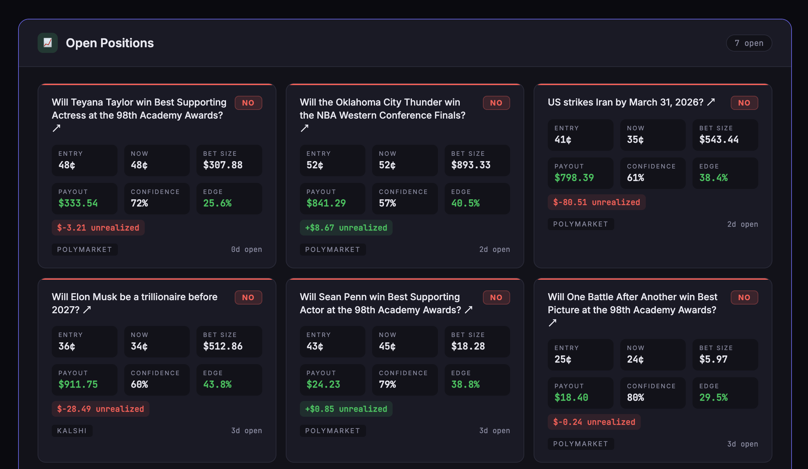

# Polyclawd

**AI-powered prediction market paper trading bot by Virtuoso Crypto.**

Automated signal detection, position sizing, and portfolio management across Polymarket, Kalshi, and cross-platform arbitrage.

🔗 **Live Dashboard**: [virtuosocrypto.com/polyclawd](https://virtuosocrypto.com/polyclawd/portfolio.html)
🔗 **MCP Server**: [virtuosocrypto.com/polyclawd/mcp](https://virtuosocrypto.com/polyclawd/mcp) (140 tools)



---

## How It Works

Every 10 minutes, the system scans prediction markets for mispriced contracts, runs signals through an 11-stage pipeline, and auto-manages a $10K paper portfolio.

```
Market Data → Signal Detection → 11-Stage Pipeline → Kelly Sizing → Position Open
                                                                          ↓
Resolution ← Watchdog (5min) ← Re-evaluation ← Price Monitoring ← Portfolio
```

### Signal Pipeline

```
Signal → Confidence → Edge → Archetype Blocklist → NO Prob Floor
→ Kelly Sizing → CV Kelly → Time Decay → Volume Spike
→ Score Velocity → Archetype Boost → Correlation Cap → TRADE
```

| Stage | What it does |
|-------|-------------|
| **Archetype Blocklist** | `price_above` (0% WR) and `sports_winner` (0% WR) blocked entirely |
| **NO Prob Floor** | Skip markets where NO <35% implied — too efficient to fade |
| **Bootstrap Kelly** | Seeded 57% WR + 1/8 Kelly until 20 resolved trades |
| **CV Kelly Haircut** | Monte Carlo uncertainty adjustment (post-bootstrap) |
| **Time Decay** | Becker-calibrated 28-cell lookup (7 durations × 4 volume buckets) |
| **Volume Spike** | 3x+ = spike (+10%), 10x+ = mega (+20%) |
| **Score Velocity** | Alpha score delta for crypto archetypes [0.7x–1.3x] |
| **Correlation Cap** | 6 groups, max 3 positions per group |

### Correlation Groups

| Group | Examples | Max |
|-------|---------|-----|
| Politics | US elections, policy | 3 |
| Geopolitical | Foreign elections, wars | 3 |
| Culture | Oscars, entertainment | 3 |
| Sports | NBA, NFL, soccer | 3 |
| Crypto | BTC/ETH/SOL price | 3 |
| Weather | Temperature markets | 3 |

---

## Data Sources

### Active
| Source | Type | Use Case |
|--------|------|----------|
| **Polymarket** | Prediction market | Main execution venue — crypto, politics, weather, entertainment |
| **Kalshi** | Prediction market | Market overlap detection, entertainment props |
| **Manifold** | Play money market | Leading indicator (moves first), election divergence |
| **Metaculus** | Forecasting | Expert forecasts vs market prices |
| **ESPN** | Sports odds | Fallback for Vegas when circuit-broken |
| **Open-Meteo** | Weather (92 ensemble members) | Temperature forecasting — ICON, GEFS, GEM models |
| **Pirate Weather** | Weather (GEFS+HRRR+ECMWF) | Multi-model weather ensemble source |
| **Tomorrow.io** | Weather (proprietary AI) | HyperCast AI model for weather ensemble |
| **WeatherAPI.com** | Weather (station blend) | Station-based ML blend for weather ensemble |
| **Wikipedia** | Election polling | Polling data scraper for election markets |

---

## Weather Ensemble

4-source probabilistic forecasting with calibrated probability distributions:

| Source | Models | Cost |
|--------|--------|------|
| Open-Meteo Ensemble | 92 members (ICON, GEFS, GEM) | Free |
| Pirate Weather | GEFS + GFS + HRRR + ECMWF | Free tier |
| Tomorrow.io | Proprietary AI (HyperCast) | Free tier |
| WeatherAPI.com | Station blend + ML | Free tier |

- **Normal/Student-t CDF** for real probability calculations (not hardcoded buckets)
- Source disagreement >3°F auto-widens distribution (fat tail penalty)
- Multi-day response caching — 1 API call per city returns all dates
- **Same-day re-evaluation** every 5min — auto-closes if forecast shifts against position
- 15 cities: NYC, London, Buenos Aires, Wellington, Miami, Dallas, Atlanta, São Paulo, Toronto, Seoul, Seattle, Chicago, Paris, Sydney, Tokyo

## Election Prediction

- Wikipedia polling scraper with recency weighting (30d=1.0x, 90d=0.7x, >90d=0.4x)
- Manifold vs Polymarket divergence (>10% = 1.3x boost, 5-10% = 1.15x)
- Incumbency advantage as systematic NO thesis (~70% win rate globally)

## API Resilience

- **Circuit breaker** — 5 failures → 30min cooldown per source
- **Staleness tags** — flags data from degraded sources
- **ESPN fallback** — Vegas endpoints auto-fallback when circuit-broken

---

## Architecture

```
polyclawd/
├── api/                # FastAPI app (140+ endpoints)
│   ├── main.py         # App factory, router registration
│   ├── routes/         # 6 domain routers
│   └── services/       # Business logic
├── signals/            # Trading engine
│   ├── paper_portfolio.py      # Core engine + 11-stage pipeline
│   ├── weather_ensemble.py     # 4-source probabilistic forecasting
│   ├── weather_scanner.py      # Polymarket weather market discovery
│   ├── election_polls.py       # Wikipedia polling scraper
│   ├── cross_platform_elections.py  # Cross-platform divergence
│   ├── cv_kelly.py             # CV Kelly uncertainty adjustment
│   ├── strike_probability.py   # Price-to-Strike probability
│   ├── alpha_score_tracker.py  # Score velocity tracking
│   ├── resilience.py           # Circuit breaker + source health
│   ├── ic_tracker.py           # Information Coefficient tracking
│   └── calibrator.py           # Signal calibration + source weights
├── mcp/                # MCP server (auto-discovered from OpenAPI)
│   ├── server.py       # stdio transport
│   └── http_server.py  # FastMCP HTTP (port 8421)
├── static/             # Dashboard + auth
│   ├── portfolio.html  # Paper trading dashboard
│   ├── analysis.html   # Signal analysis
│   └── how-it-works.html  # Pipeline visualization
├── odds/               # Edge math + cross-platform
├── tests/              # 300+ tests
├── scripts/            # Utilities
├── docs/               # Documentation
└── config/             # Configuration
```

### Data Flow

```
┌─────────────────────────────────────────────────────────────────┐
│                         DATA SOURCES                             │
├───────────┬──────────┬──────────┬──────────┬───────────┬────────┤
│Polymarket │ Manifold │  ESPN    │ Metaculus │ Weather×4 │ Polls  │
│  Kalshi   │          │          │          │ (ensemble)│ (Wiki) │
└─────┬─────┴────┬─────┴────┬─────┴────┬─────┴─────┬─────┴───┬────┘
      └──────────┴──────────┴────┬─────┴───────────┴─────────┘
                                 ▼
              ┌──────────────────────────────────┐
              │   API RESILIENCE LAYER           │
              │   Circuit breaker + staleness    │
              └──────────────┬───────────────────┘
                             ▼
              ┌──────────────────────────────────┐
              │   SIGNAL PIPELINE (11 stages)    │
              │   Confidence → Edge → Blocklist  │
              │   → Kelly → Time Decay → Vol     │
              │   → Score Velocity → Corr Cap    │
              └──────────────┬───────────────────┘
                             ▼
              ┌──────────────────────────────────┐
              │   PAPER PORTFOLIO ENGINE         │
              │   Bootstrap Kelly · $10K bank    │
              │   6 correlation groups · 10 max  │
              └──────────────┬───────────────────┘
                             ▼
              ┌──────────────────────────────────┐
              │   WATCHDOG (every 5-10min)       │
              │   Resolution · Re-eval · IC      │
              └──────────────┬───────────────────┘
                             ▼
              ┌──────────────────────────────────┐
              │   MCP SERVER (140 tools)         │
              │   + Dashboard + Discord alerts   │
              └──────────────────────────────────┘
```

---

## MCP Server

**140 tools auto-discovered from OpenAPI spec** — no manual tool list to maintain.

```
https://virtuosocrypto.com/polyclawd/mcp
```

Add an API endpoint → restart MCP → tool appears automatically. Tools are named by path: `/api/signals/weather` → `polyclawd_signals_weather`.

---

## Operations

### Infrastructure
- **VPS**: Hetzner (`ssh vps` / 5.223.63.4)
- **Service**: `polyclawd-api.service` (systemd, port 8420, 2 uvicorn workers)
- **MCP**: port 8421, proxied via nginx
- **Reverse proxy**: nginx at `virtuosocrypto.com/polyclawd`
- **Database**: SQLite `storage/shadow_trades.db` (WAL mode)
- **Test suite**: 300+ tests

### Watchdog (v8)

Runs every 5 minutes via `/etc/cron.d/polyclawd-watchdog`:

| Cycle | Frequency | What it does |
|-------|-----------|-------------|
| Health check | 5min | 3 retries → restart if unhealthy |
| Resolution | 5min | CLOB → Gamma fallback → force-resolve 24h+ past expiry |
| Weather re-eval | 5min | Fresh ensemble data, auto-close on edge flip |
| Signal scan | 10min | Mispriced category + weather → `process_signals()` |
| Alpha snapshot | 10min | Score velocity per crypto symbol |
| IC + Calibration | 30min | Spearman IC, calibration curves, source weights |
| Arena snapshot | 6h | Leaderboard tracking |

### Quick Start

```bash
# Local development
cd ~/Desktop/polyclawd
uvicorn api.main:app --host 127.0.0.1 --port 8420

# VPS
ssh vps
sudo systemctl status polyclawd-api
sudo systemctl restart polyclawd-api
tail -50 /var/log/polyclawd-watchdog.log
```

### API Docs

Full OpenAPI spec: `https://virtuosocrypto.com/polyclawd/api/openapi.json`

Key endpoint groups: `/api/signals/*`, `/api/portfolio/*`, `/api/edge/*`, `/api/vegas/*`, `/api/espn/*`, `/api/polyrouter/*`, `/api/markets/*`

---

## License

Proprietary — Virtuoso Crypto
