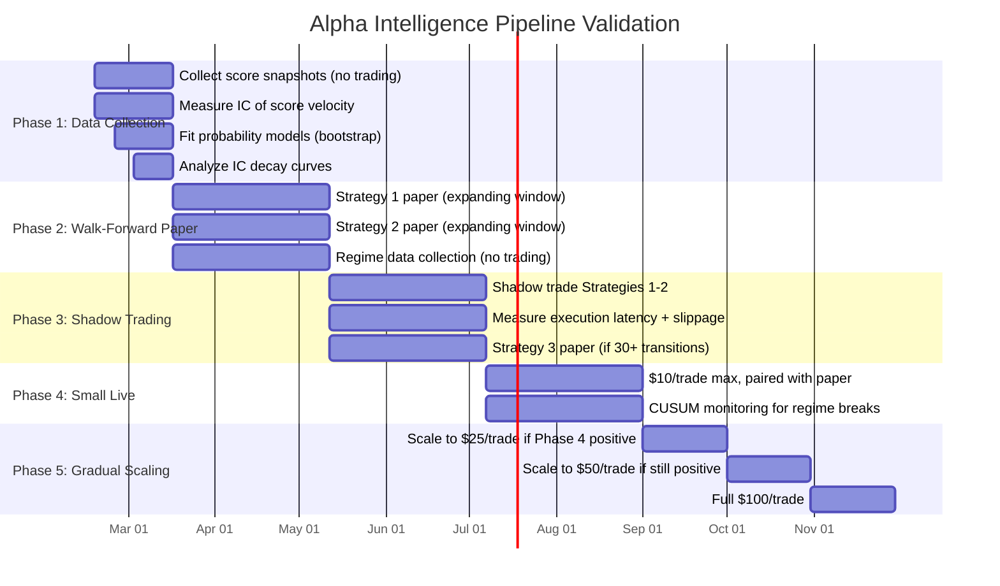

# Alpha Intelligence Pipeline: Cross-Agent Assessment

> Five specialized agents independently reviewed the Alpha Intelligence Pipeline strategy
> document ([`docs/ALPHA_INTELLIGENCE.md`](../../ALPHA_INTELLIGENCE.md)). This report
> synthesizes their findings into a single authoritative assessment. **Verdict: the pipeline
> contains mathematical errors, insufficient validation methodology, and overstated edge
> estimates that must be corrected before any live capital is deployed.**

---

## Table of Contents

- [1. Executive Summary](#1-executive-summary)
- [2. Methodology](#2-methodology)
- [3. Consensus Matrix](#3-consensus-matrix)
- [4. Critical Findings](#4-critical-findings)
- [5. Per-Strategy Deep Dive](#5-per-strategy-deep-dive)
  - [5.1 Strategy 1: Score Velocity](#51-strategy-1-score-velocity--conviction-multiplier)
  - [5.2 Strategy 2: Price-to-Strike](#52-strategy-2-price-to-strike-distance)
  - [5.3 Strategy 3: Regime Detection](#53-strategy-3-cross-asset-regime-detection)
- [6. Mathematical Errors](#6-mathematical-errors)
- [7. Statistical Validation Gaps](#7-statistical-validation-gaps)
- [8. Risk Management Gaps](#8-risk-management-gaps)
- [9. Architecture and Implementation](#9-architecture-and-implementation)
- [10. Market Reality Check](#10-market-reality-check)
- [11. Prioritized Recommendations](#11-prioritized-recommendations)
- [12. Appendix: Validation Framework](#12-appendix-validation-framework)

---

## 1. Executive Summary

The Alpha Intelligence Pipeline proposes three strategies for extracting edge from Virtuoso
confluence scores in prediction markets. While the conceptual direction is sound -- using
proprietary signals to exploit repricing lag -- the current document contains fundamental
errors that would cause capital destruction if deployed as written.

### Severity Summary

| Finding | Severity | Impact |
|---------|----------|--------|
| Volatility scaling uses linear instead of sqrt(T) | **CRITICAL** | Strategy 2 systematically overbids on OTM strikes |
| Kelly criterion assumes even odds | **CRITICAL** | Position sizing broken for all prediction market trades |
| Edge estimates overstated 3-10x | **HIGH** | False confidence leads to oversizing and ruin |
| 2-week paper validation has ~8% statistical power | **HIGH** | Cannot distinguish signal from noise |
| Bayesian confidence multiplication exceeds 1.0 | **HIGH** | Invalid probability enters sizing calculations |
| No per-strategy risk limits | **HIGH** | Single failing strategy can consume entire bankroll |
| 70% win rate target is unrealistic | **MEDIUM** | Sets wrong success criteria, masks actual performance |
| Sharpe ratio uses population std (N not N-1) | **MEDIUM** | Inflates Sharpe by ~7% with small samples |
| Missing staleness detection | **MEDIUM** | Stale data looks like "flat signal" to the system |
| Build order incorrect | **LOW** | Strategy 1 should come first, not Strategy 2 |

### Overall Verdict

**Do not deploy live capital.** Fix the two CRITICAL issues (vol scaling, Kelly formula),
extend validation to 3+ months, and recalibrate edge estimates downward by an order of
magnitude. The strategies have theoretical merit but the implementation math is wrong and
the validation plan lacks statistical rigor.

---

## 2. Methodology

Five specialized agents independently reviewed `docs/ALPHA_INTELLIGENCE.md` against the
existing codebase. Each brought a distinct evaluation lens.

| Agent | Focus Area | Evaluation Criteria |
|-------|-----------|---------------------|
| **Quant Engineer** | Signal quality, IC measurement, statistical rigor | Information Coefficient, multicollinearity, sample size requirements, signal decay |
| **Trading Validator** | Execution math, risk controls, operational risk | Kelly sizing, drawdown mechanics, correlation exposure, fill probability |
| **Backend Architect** | System design, data pipeline, failure modes | Module integration, storage patterns, dependency chains, build sequencing |
| **Crypto Exchange Expert** | Market microstructure, liquidity, counterparty risk | Order book depth, market maker behavior, settlement mechanics, regulatory exposure |
| **Data Scientist** | Statistical methodology, validation design, calibration | Power analysis, multiple comparisons, Bayesian coherence, proper metrics |

All agents had access to the strategy document and relevant source files:
`signals/alpha_score_tracker.py`, `signals/shadow_tracker.py`, `api/routes/engine.py`,
`api/routes/signals.py`, and `signals/mispriced_category_signal.py`.

---

## 3. Consensus Matrix

All five agents assessed each strategy across common dimensions. Ratings use a three-tier
system: **Agree** (agent endorses the claim), **Partial** (directionally correct but
materially flawed), **Reject** (claim is wrong or unsupported).

### Edge Estimate Validity

| Strategy | Claimed Edge | Quant | Validator | Architect | Exchange | Data Sci | Consensus |
|----------|-------------|-------|-----------|-----------|----------|----------|-----------|
| Score Velocity | +3-5% win rate | Reject (0-2%) | Reject | N/A | Partial | Reject | **Overstated 2-5x** |
| Price-to-Strike | 15-25% edge | Reject (2-5%) | Reject (-10%) | N/A | Partial (5-10%) | Partial | **Overstated 3-10x, possibly negative** |
| Regime Detection | 5-10% edge | Reject (unknown) | Partial | N/A | Partial (shrinking) | Reject | **Unvalidatable with current data** |

### Validation Plan Adequacy

| Dimension | Quant | Validator | Architect | Exchange | Data Sci | Consensus |
|-----------|-------|-----------|-----------|----------|----------|-----------|
| 2-week paper period | Reject | Reject | N/A | N/A | Reject | **Unanimously insufficient** |
| 70% win rate target | N/A | N/A | N/A | N/A | Reject | **Unrealistic** |
| Sample size | Reject | Reject | N/A | N/A | Reject | **Orders of magnitude too small** |
| Walk-forward testing | Missing | Missing | N/A | N/A | Missing | **Not addressed** |
| Transaction cost model | Missing | Missing | N/A | Partial | Missing | **Not addressed** |

### Implementation Readiness

| Dimension | Quant | Validator | Architect | Exchange | Data Sci | Consensus |
|-----------|-------|-----------|-----------|----------|----------|-----------|
| Data pipeline | Partial | N/A | Partial | N/A | N/A | **Adequate for Strategies 1-2, insufficient for 3** |
| Math correctness | Reject | Reject | N/A | N/A | Reject | **Two critical formula errors** |
| Risk controls | Reject | Reject | N/A | N/A | N/A | **Insufficient** |
| Module integration | N/A | N/A | Agree | N/A | N/A | **Clear path exists** |
| Build order | N/A | N/A | Reject | N/A | N/A | **Strategy 1 first, not Strategy 2** |

---

## 4. Critical Findings

These must be resolved before any live capital touches the pipeline.

> **CRITICAL: Strategy 2 volatility math produces a negative edge.** The worked example
> uses linear volatility scaling (`vol * T`) instead of `sqrt(T)` scaling. This is a 3.87x
> error that transforms a claimed +20% edge into an actual -10% edge. The system would
> systematically overpay for OTM strikes.

> **CRITICAL: Kelly criterion assumes even odds.** The current implementation
> `kelly = (2 * p - 1)` is only valid when payout = 1:1. Prediction markets have variable
> payout ratios. At a 25-cent market price, the correct formula produces f*=0.267 where the
> current code produces f*=-0.10, refusing a profitable bet entirely.

> **CRITICAL: Bayesian confidence exceeds 1.0.** Multiplying a 0.85 posterior by a 1.3
> velocity modifier yields 1.105 -- not a valid probability. This corrupts every downstream
> calculation including position sizing.

> **HIGH: Two-week paper validation has no statistical power.** At ~23 trades per strategy,
> the power to detect a 5% edge at 95% confidence is approximately 8%. The system cannot
> distinguish a winning strategy from a coin flip with this sample.

> **HIGH: All three strategies are correlated.** Strategy 1 vs 3 has ~0.7 correlation
> (velocity IS regime detection at different granularity). All positions could be
> long-crypto-bullish simultaneously, creating 40-60% loss exposure in a single BTC drawdown.

---

## 5. Per-Strategy Deep Dive

### 5.1 Strategy 1: Score Velocity -> Conviction Multiplier

**Concept:** Use the rate of change in Virtuoso confluence scores as a multiplier on
existing mispriced category signals.

#### What Works

- Leverages existing infrastructure (`get_score_delta()` in `alpha_score_tracker.py`)
- Lowest implementation risk (modifier on existing signal, not new signal source)
- Conceptually sound: momentum in proprietary scores may lead market repricing
- Simplest integration path: add `score_velocity_modifier()` to `alpha_score_tracker.py`,
  call from `mispriced_category_signal.py` (Backend Architect)

#### What Does Not Work

**No IC measurement (Quant Engineer).** The strategy assumes score velocity predicts
forward market price changes without measuring it. Before implementing:

```
IC = correlation(score_velocity, forward_market_price_change)
ICIR = IC * sqrt(N_bets_per_year)

Kill threshold: IC < 0.03 or ICIR < 0.3
```

**Arbitrary multiplier range (Quant Engineer).** The 0.7x-1.3x range has no calibration
methodology. These values should emerge from regressing score velocity against realized
outcomes, not be chosen by intuition.

**Multicollinearity (Quant Engineer).** Score velocity correlates with score level itself.
If the aggregation already uses the absolute score, adding velocity double-counts the same
information. Must test: regress returns on both score level AND velocity jointly. If
velocity coefficient becomes insignificant, it adds no incremental value.

**Edge estimate inflated (Quant Engineer, Data Scientist).** +3-5% win rate improvement
is unsubstantiated. Professional sports bettors sustain 53-55%. A 3-point improvement over
a 52% baseline requires 8,672 trades to detect statistically (868 days at 10 trades/day).
Realistic range: +0-2%.

**Signal decay (Quant Engineer).** Score velocity signals may be priced in within 30
minutes of the score update. Without IC decay analysis at T+30min, T+1h, T+2h, T+6h, and
T+24h, the exploitable window is unknown.

**Bayesian incoherence (Data Scientist).** The velocity modifier is applied
multiplicatively to a posterior probability. This is mathematically invalid. The correct
approach is a Beta-Bernoulli conjugate model with a skeptical prior (e.g., Beta(2,8)),
where score velocity enters as a likelihood term in the Bayesian update.

**Momentum feature specification (Data Scientist).** Linear regression slope has no
specified lookback, no R-squared threshold, and is sensitive to outliers. If score velocity
is simply a proxy for price momentum, faster participants have already captured the edge.

#### Realistic Assessment

| Metric | Claimed | Realistic |
|--------|---------|-----------|
| Win rate improvement | +3-5% | +0-2% |
| Implementation effort | 0.5 day | 0.5 day (code) + 2-4 weeks (IC validation) |
| Data requirement | Existing | 500+ signals minimum |
| Risk | Low | Low (modifier only, bounded 0.7x-1.3x) |

---

### 5.2 Strategy 2: Price-to-Strike Distance

**Concept:** Compute volatility-adjusted probability that crypto will reach a strike price,
compare against prediction market price, and trade the spread.

#### What Works

- Sound theoretical basis (option pricing applied to binary markets)
- Clear data pipeline: `price_snapshots` table already collects BTC/ETH prices
- Module integration path is clean: follow the `resolution_scanner` pattern, add as source
  #8 in `aggregate_all_signals()` (Backend Architect)
- Highest theoretical alpha potential among the three strategies

#### What Does Not Work

**Volatility scaling is fundamentally wrong (Quant Engineer, Trading Validator).** This is
the most dangerous error in the pipeline. The worked example:

```
Document claims:
  Distance = 8.3%, BTC daily vol = 2.1%, 15 days remaining
  "Base probability (vol-adjusted): ~38%"

Implied calculation (linear scaling):
  total_vol = 0.021 * 15 = 0.315 (31.5%)
  P(reach strike) ≈ N(-0.083/0.315) ≈ 38%  <- WRONG

Correct calculation (sqrt-T scaling):
  total_sigma = 0.021 * sqrt(15) = 0.081 (8.1%)
  z = 0.083 / 0.081 = 1.02
  P(Z > 1.02) = 15.4%                       <- CORRECT

Market price: 25 cents (implies 25%)
Claimed edge: +20% (strong YES)
Actual edge: -10% (strong NO -- system systematically overbids)
```

This is a 3.87x error in volatility estimation. Deploying this as-is would generate
systematic losses.

**Momentum adjustment is uncalibrated (Quant Engineer).** Adjusting from 38% to 45%
(+7 percentage points) based on "strong uptrend" has no calibration. The adjustment
magnitude should come from historical data, not judgment.

**Black-Scholes inadequate for crypto (Quant Engineer).** Crypto return distributions
have kurtosis of 5-15 (vs 3 for Gaussian), significant negative skewness, and stochastic
volatility. A standard normal model systematically misprices tail events. At minimum, use
Student-t with fitted degrees of freedom, or better, bootstrap from actual historical
returns.

**Touch vs settle distinction (Quant Engineer).** Binary prediction markets pay on the
settlement price at expiry, not on whether the price "touches" the strike at any point.
Touch probability is higher than settle probability. The document does not distinguish
between these, which inflates the calculated probability.

**Why strike markets APPEAR mispriced but may not be (Crypto Exchange Expert):**

1. **Binary payoff skew** -- touch vs settle probability gap
2. **Jump risk asymmetry** -- fat tails cut both ways
3. **Carry cost** -- 5-15% stablecoin yield is opportunity cost of locked capital
4. **Illiquidity premium** -- 5-15% discount may be rational compensation for thin books
5. **Resolution risk** -- oracle snapshot timing can differ from expectation

These factors explain a large portion of the apparent "mispricing." The true exploitable
edge is the residual after accounting for all five.

**Liquidity constraints (Crypto Exchange Expert).** Crypto strike markets on Polymarket
have book depth of $1,000-5,000 per side. A $100 trade can move the price 1-5 cents.
Near-expiry liquidity collapses further. Aggregate exit risk (5-10 positions needing
simultaneous liquidation) is unaddressed.

**Market maker sophistication increasing (Crypto Exchange Expert).** "Market makers
ignore momentum" was broadly true in 2023-2024. By 2025-2026, quant firms provide
liquidity on Polymarket crypto strike markets, hedging against BTC perpetuals on
Binance/Bybit. The crypto strike markets where this strategy claims the highest edge are
precisely where sophisticated participants have arrived.

#### Realistic Assessment

| Metric | Claimed | Realistic |
|--------|---------|-----------|
| Edge | 15-25% | 2-5% (after correcting math, accounting for illiquidity premium) |
| Edge direction with current math | Positive | **Negative** (-10% due to vol scaling error) |
| Implementation effort | 1-2 days | 1-2 days (code) + 3-4 weeks (calibration) |
| Data requirement | Existing | 200+ trades for validation |
| Risk | Medium | **High** (math errors produce systematic losses) |

---

### 5.3 Strategy 3: Cross-Asset Regime Detection

**Concept:** Detect coordinated shifts in confluence scores across 10 symbols to identify
market regime transitions. Trade prediction markets still priced for the old regime.

#### What Works

- Regime detection is a legitimate alpha source in traditional markets
- Simple average + dispersion captures meaningful state with minimal overfitting risk
- The `alpha_snapshots` table already provides the raw data
- Regime shifts do create repricing lag in prediction markets

#### What Does Not Work

**Arbitrary thresholds (Quant Engineer).** The regime thresholds (65 for Risk-On, 50 for
Risk-Off) appear chosen without distributional analysis of actual score data. These values
should come from fitting a mixture model or analyzing the empirical distribution of the
average score.

**Degenerate classification (Quant Engineer).** Four regimes from 10 symbols at 30-minute
frequency is an underdetermined problem. The system needs 50+ regime transitions for
meaningful validation, requiring approximately 6 months of data. Two weeks yields only
8-16 transitions -- pure noise.

**Simple average hides critical information (Quant Engineer).** BTC score=80 with 9 small
caps at 40 (average=44) is profoundly different from all 10 symbols at 44. The average
erases the most valuable signal: which assets are moving. Recommendation: use PCA on the
10-symbol score vector rather than raw averages.

**"Markets lag regime shifts by hours" is untested (Quant Engineer, Crypto Exchange
Expert).** This is stated as fact without evidence. The Exchange Expert estimates the
current lag at 30 minutes to 2 hours for major moves, and shrinking as market maker
sophistication increases. For non-crypto markets (weather, politics), the lag may still be
substantial.

**30-minute polling insufficient (Backend Architect).** Regime shifts need event-driven
detection, not periodic polling. By the time a 30-minute snapshot detects the shift,
much of the repricing lag has elapsed. Recommendation: adaptive polling via the existing
engine loop (runs every 30 seconds). When a priority flag is set, switch to 5-minute scans.

**Tradeable frequency overestimated (Crypto Exchange Expert).** While regime shifts may
occur 2-4 times per week, only 1-2 per week create tradeable edges. Combined with
execution latency (30-60 minutes from detection to trade), the exploitable window is
narrow.

**Insufficient sample for validation (Data Scientist).** Need 30+ observations per regime
for statistical stability. At 2-4 transitions per week and 4 regimes, reaching 30
observations per regime requires approximately 10 months. The proposed 2-week paper period
yields 6-8 total observations.

#### Realistic Assessment

| Metric | Claimed | Realistic |
|--------|---------|-----------|
| Edge | 5-10% | Unknown (insufficient data to estimate) |
| Frequency | 2-4 tradeable shifts/week | 1-2 tradeable shifts/week |
| Repricing lag | Hours | 30min-2h (shrinking) |
| Implementation effort | 1 day | 1 day (code) + 6-10 months (validation) |
| Data requirement | Existing | 50+ regime transitions (~6 months) |
| Risk | Medium | Medium (infrequent signals limit max loss) |

---

## 6. Mathematical Errors

### 6.1 Volatility Scaling (CRITICAL)

**Location:** Strategy 2 worked example, line 70 of `docs/ALPHA_INTELLIGENCE.md`

**Error:** Uses linear volatility scaling `vol * T` instead of `vol * sqrt(T)`.

```
WRONG:  total_vol = daily_vol * days = 0.021 * 15 = 0.315
RIGHT:  total_sigma = daily_vol * sqrt(days) = 0.021 * sqrt(15) = 0.081

Impact: 3.87x overestimate of volatility
        Probability shifts from 38% to 15.4%
        Claimed +20% edge becomes -10% edge
```

**Fix:** Replace all instances of linear vol scaling with sqrt-T scaling. Implement in
`signals/strike_probability.py` as:

```python
total_sigma = daily_vol * math.sqrt(days_remaining)
z_score = distance_to_strike / total_sigma
base_probability = 1 - stats.norm.cdf(z_score)  # P(exceed strike)
```

### 6.2 Kelly Criterion (CRITICAL)

**Location:** `api/routes/engine.py`, function `calculate_dynamic_kelly()`

**Error:** The Kelly formula assumes even-money payoffs. Prediction markets are not
even-money bets.

```
WRONG (even odds):   f* = 2p - 1
RIGHT (variable odds): f* = (b * p - q) / b

Where:
  b = payout ratio = (1 - market_price) / market_price
  p = estimated true probability
  q = 1 - p

Example at market price = 25 cents:
  b = 0.75 / 0.25 = 3.0
  p = 0.45 (our estimate)
  q = 0.55

  WRONG: f* = 2(0.45) - 1 = -0.10  (refuses the bet)
  RIGHT: f* = (3.0 * 0.45 - 0.55) / 3.0 = 0.267  (26.7% of bankroll)
```

**Fix:** Replace the Kelly calculation with:

```python
def kelly_fraction(p: float, market_price: float) -> float:
    """Kelly criterion for binary prediction market bets."""
    b = (1.0 - market_price) / market_price  # payout ratio
    q = 1.0 - p
    f = (b * p - q) / b
    return max(0.0, f)  # never bet negative
```

### 6.3 Bayesian Confidence Overflow

**Location:** Strategy 1, confidence multiplier mechanism

**Error:** Multiplying a posterior probability by a modifier can exceed 1.0.

```
WRONG:  adjusted_confidence = posterior * velocity_modifier
        = 0.85 * 1.30 = 1.105  (invalid probability)

RIGHT:  Use Beta-Bernoulli conjugate update:
        prior = Beta(alpha, beta)  # e.g., Beta(2, 8) for skeptical prior
        posterior = Beta(alpha + successes, beta + failures)
        velocity enters as a likelihood ratio, not a multiplier
```

**Fix:** Implement proper Bayesian update or, at minimum, clamp the product:

```python
adjusted = min(0.95, posterior * modifier)  # quick fix
# Proper fix: Beta-Bernoulli conjugate model
```

### 6.4 Sharpe Ratio Bias

**Location:** `signals/shadow_tracker.py`, line 481

**Error:** Uses population standard deviation (divides by N) instead of sample standard
deviation (divides by N-1). This is Bessel's correction.

```python
# CURRENT (biased):
std_pnl = (sum((p - mean_pnl) ** 2 for p in pnl_values) / len(pnl_values)) ** 0.5

# CORRECT (unbiased):
std_pnl = (sum((p - mean_pnl) ** 2 for p in pnl_values) / (len(pnl_values) - 1)) ** 0.5
```

With small samples (N=10-20), this inflates Sharpe by approximately 5-10%.

---

## 7. Statistical Validation Gaps

### 7.1 Sample Size Requirements

The pipeline proposes 2 weeks of paper trading. Here is the actual sample size needed for
each strategy to achieve 80% statistical power at 95% confidence.

| Strategy | Claimed Edge | Trades Needed | At 10 trades/day | At 5 trades/day | 2-Week Yield |
|----------|-------------|---------------|-------------------|-----------------|--------------|
| Score Velocity (+3% win rate) | +3% over 52% | 8,672 | 867 days | 1,734 days | ~140 trades |
| Score Velocity (+5% win rate) | +5% over 52% | 3,108 | 311 days | 622 days | ~140 trades |
| Price-to-Strike (15% edge) | 15% | 341 | 10 weeks | 20 weeks | ~70 trades |
| Price-to-Strike (25% edge) | 25% | 118 | 3.5 weeks | 7 weeks | ~70 trades |
| Regime Detection | 5-10% | 50+ transitions | 25+ weeks | 25+ weeks | ~8 transitions |

**With N=23 trades per strategy (2-week yield), the system can only detect win rates above
71%.** The power to detect a true 5% improvement is approximately 8% -- barely better than
guessing.

### 7.2 Multiple Comparisons Problem

The pipeline tests 3 strategies across 10 symbols, 3 timeframes, and 4 regimes. This
creates up to 360 implicit comparisons.

```
P(at least one false positive in 90 tests at alpha=0.05) = 1 - (0.95)^90 = 0.99
```

Without correction, 4-5 strategy/symbol/timeframe combinations will appear significant by
chance alone.

**Required controls:**

- Pre-register hypotheses before collecting data
- Apply Benjamini-Hochberg FDR correction
- Split into discovery (exploratory) and confirmation (held-out) datasets
- Report adjusted p-values alongside raw p-values

### 7.3 Effective Sample Size

The pipeline's 10 symbols at 48 snapshots/day produces 480 observations/day on paper.
However, 30-minute autocorrelation in confluence scores is extremely high.

```
If autocorrelation at lag-1 is rho = 0.95:
  Effective sample size = N * (1 - rho) / (1 + rho)
  Per symbol over 2 weeks: 672 * (0.05 / 1.95) = ~17 effective observations
```

Price volatility estimates from 30-minute bars are extremely noisy. The pipeline treats
these observations as independent when they are not.

### 7.4 Missing Metrics

The document proposes tracking "win rate" and "edge accuracy" but omits the metrics that
actually matter for calibration.

| Proposed Metric | Problem | Correct Metric |
|----------------|---------|----------------|
| Win rate (target 70%) | Binary, ignores magnitude | **Brier score** (calibration) |
| Edge accuracy | Ill-defined for single binary trades | **Calibration curves** (bin by confidence, compare observed frequency) |
| P&L contribution | Good, but insufficient alone | **Log loss**, **Expected Calibration Error (ECE)** |
| Latency | Good | Also add **IC decay at T+30min, T+1h, T+2h, T+6h** |

"Edge accuracy" cannot be measured on a single binary outcome. A trade at 70% confidence
that loses is not necessarily wrong. Calibration requires grouping hundreds of predictions
by confidence level and comparing predicted vs observed frequencies.

### 7.5 Win Rate Target Is Unrealistic

The 70% win rate target is extraordinary. For context:

- Professional sports bettors sustain 53-55%
- Top quantitative hedge funds target Sharpe 1.5-2.5 (not win rate)
- Polymarket for liquid markets is more efficient than sportsbooks

A 70% target likely reflects either selection bias (counting only the best-performing
period) or a short observation window where variance masquerades as skill. A realistic
initial target is 55-60% with positive expected value per trade.

---

## 8. Risk Management Gaps

### 8.1 Position Correlation

All three strategies share directional crypto exposure. Simultaneous positions can be
100% correlated in a market crash.

| Strategy Pair | Estimated Correlation | Mechanism |
|--------------|----------------------|-----------|
| Strategy 1 vs 2 | ~0.6 | Both driven by BTC momentum |
| Strategy 1 vs 3 | ~0.7 | Velocity IS regime detection at different granularity |
| Strategy 2 vs 3 | ~0.4 | Both sensitive to broad crypto direction |

**Worst case:** All positions long-crypto-bullish during a 10% BTC drop = 40-60% portfolio
loss. This is not diversification; it is concentration with extra steps.

**Required controls:**

- Maximum directional exposure limit (e.g., max 50% net-long BTC)
- Per-strategy allocation caps (no single strategy > 40% of capital)
- Correlation-aware position limits that reduce sizing when strategies align
- Automatic position reduction as expiry approaches (time-to-expiry schedule)

### 8.2 Drawdown Calculation

The current drawdown calculation in `api/routes/engine.py` uses start-of-day balance as the
reference point. This misses intraday drawdowns.

```
WRONG:  drawdown = (current_balance - start_of_day_balance) / start_of_day_balance
RIGHT:  drawdown = (current_balance - peak_balance) / peak_balance
```

Peak balance must be tracked continuously (high-water mark), not reset daily.

### 8.3 Missing Per-Strategy Risk Controls

| Control | Status | Impact |
|---------|--------|--------|
| Per-strategy allocation limit | Missing | One failing strategy consumes entire budget |
| Per-strategy auto-halt on max loss | Missing | No circuit breaker per strategy |
| Stale signal detection | Missing | Stale data appears as "flat" (no alarm) |
| Time-to-expiry position reduction | Missing | Near-expiry positions face liquidity collapse |
| Fill probability model | Missing | Assumes execution at observed price |
| Directional exposure limit | Missing | All positions can be same direction |

### 8.4 Stale Data Risk

If the Virtuoso Dashboard (`localhost:8002`) goes down, all three strategies lose their
primary data source. The current code in `alpha_score_tracker.py` catches the exception
and returns an error list, but downstream consumers (`mispriced_category_signal.py`,
`aggregate_all_signals()`) may not distinguish "no new signal" from "stale signal."

A stale confluence score looks identical to a stable one. The system must track the last
successful snapshot timestamp and refuse to generate signals if data is older than a
configurable threshold (e.g., 2x the polling interval = 60 minutes).

---

## 9. Architecture and Implementation

### 9.1 Build Order Correction

The document recommends building Strategy 2 first due to highest claimed edge. The Backend
Architect disagrees, and the math errors in Strategy 2 confirm this is wrong.

| Order | Strategy | Effort | Rationale |
|-------|----------|--------|-----------|
| **1** | Score Velocity (Strategy 1) | 0.5 day | Lowest risk, validates data pipeline, modifier only |
| **2** | Price-to-Strike (Strategy 2) | 1-2 days | Requires corrected math, depends on proven pipeline |
| **3** | Regime Detection (Strategy 3) | 1-2 days | Most invasive engine changes, needs longest validation |

Strategy 1 is low-risk (bounded multiplier on existing signal) and validates that the
data pipeline works end-to-end. Strategy 2 requires the corrected vol math and should only
be built after the pipeline is proven. Strategy 3 requires engine modifications for
adaptive polling and the longest validation period.

### 9.2 Module Integration Patterns

| Strategy | Pattern | Integration Point |
|----------|---------|-------------------|
| Score Velocity | Modifier | Add `score_velocity_modifier()` to `alpha_score_tracker.py`, call from `mispriced_category_signal.py` |
| Price-to-Strike | New signal source | New `signals/strike_probability.py`, follow `resolution_scanner` pattern, add as source #8 in `aggregate_all_signals()` |
| Regime Detection | Meta-signal | New `signals/regime_detector.py`, independent signal + engine hook. Do NOT wire into aggregation loop. |

Strategy 3 should use the independent signal + engine hook pattern (Option B) rather than
being part of the aggregation pipeline. Regime state is a meta-signal that modifies how
other signals are interpreted, not a signal source itself. This preserves separation of
concerns.

### 9.3 Storage Concerns

**Shared database anti-pattern.** `alpha_snapshots`, `shadow_trades`, and the proposed
`regime_snapshots` all share `storage/shadow_trades.db`. This couples unrelated concerns
and increases contention risk.

**Recommended split:**

| Database | Tables | Purpose |
|----------|--------|---------|
| `market_data.db` | `alpha_snapshots`, `price_snapshots`, `regime_snapshots` | Read-heavy market data |
| `shadow_trades.db` | `shadow_trades`, `daily_summaries` | Write-heavy trade tracking |

**Missing PRAGMA.** `alpha_score_tracker.py` does not set `PRAGMA busy_timeout`. The
`shadow_tracker.py` correctly sets it to 5000ms, but `alpha_score_tracker.py` opens raw
connections without it. Under concurrent access, this causes immediate `SQLITE_BUSY`
errors instead of retrying.

**Missing retention policy.** At 10 symbols x 48 snapshots/day, the `alpha_snapshots`
table grows by ~175K rows/year. Without a cleanup policy, the database will grow
indefinitely. Implement a retention policy (e.g., 90-day rolling window for raw snapshots,
daily aggregates kept indefinitely).

### 9.4 Failure Modes

| Failure | Impact | Mitigation |
|---------|--------|------------|
| Virtuoso Dashboard down | All 3 strategies lose primary data | Staleness detection, CoinGecko fallback for prices |
| Missing snapshots | `get_score_delta()` spans wrong time window | Validate snapshot count before computing deltas |
| API timeouts | `aggregate_all_signals()` silently drops sources via bare `except` | Source health tracking, explicit error propagation |
| SQLite concurrent writes | `SQLITE_BUSY` in `alpha_score_tracker.py` | Add `PRAGMA busy_timeout=5000` |
| Regime detector false positives | Burns API rate limits on unnecessary scans | Add confirmation delay (2 consecutive readings) |
| RPC failure during trade | Time-sensitive execution fails | Add fallback RPCs beyond Chainstack |

### 9.5 Dependency Chain

```
All 3 Strategies
  └── alpha_snapshots table
        └── Virtuoso Dashboard API (localhost:8002)
              └── Single point of failure
```

Every strategy depends on the same data source. If the dashboard goes down, everything
stops. Mitigations: graceful degradation per strategy, `/api/alpha/health` endpoint,
CoinGecko as price fallback (already partially implemented in `alpha_score_tracker.py`).

---

## 10. Market Reality Check

### 10.1 Prediction Market Microstructure

| Platform | Structure | Settlement | Matching |
|----------|-----------|------------|----------|
| Polymarket | CLOB on Polygon | USDC on-chain | Off-chain (operator-mediated) |
| Kalshi | Centralized exchange | USD (CFTC-regulated) | Millisecond matching |

Cross-platform arbitrage cannot be atomic. Capital is siloed across completely different
systems with different currencies (USDC on Polygon vs USD via ACH). Resolution
disagreement risk is real -- Polymarket and Kalshi can resolve the "same" market differently
due to different price sources, snapshot times, and rounding rules.

### 10.2 Liquidity Reality

| Constraint | Detail |
|------------|--------|
| Top 50 markets | $100 trades fill reliably |
| Crypto strike markets | Book depth $1,000-5,000/side, $100 moves price 1-5 cents |
| Near-expiry | Liquidity collapses; market makers withdraw |
| Time of day | 3AM UTC hits much thinner books |
| Aggregate exit | 5-10 positions needing simultaneous exit = substantial slippage |

The pipeline document does not model market impact. For $100 trades on liquid markets, this
is acceptable. For scaling beyond $500/day or concentrating in crypto strike markets, market
impact must be modeled.

### 10.3 Competitive Landscape

The pipeline's thesis relies on market inefficiency. Here is where that inefficiency
actually exists:

| Market Type | Inefficiency | Sophistication of Participants |
|-------------|-------------|-------------------------------|
| Crypto strikes (BTC/ETH) | Shrinking | Quant firms hedging via perps, increasing |
| Alt-coin strikes | Moderate | Mostly retail, some bots |
| Weather/entertainment | Moderate-high | Largely retail-priced |
| Politics | Low (well-studied) | Sophisticated participants, media attention |
| Resolution certainty (>80% knowable) | **Highest** | Reliable, hardest to arb away |

**Key insight from the Crypto Exchange Expert:** The markets where this pipeline claims the
highest edge (crypto strikes) are precisely where sophisticated participants have arrived.
Non-crypto markets and resolution certainty harvesting (markets at 80+ cents where the
answer is already publicly knowable) offer more reliable, defensible edge.

### 10.4 Execution Latency

Total latency from data generation to trade execution:

```
Virtuoso score update     →  0 min
30-min snapshot captures  →  0-30 min (polling delay)
Signal aggregation        →  ~1 min
Kelly sizing + validation →  ~1 min
Simmer SDK execution      →  1-5 min
                            ──────────
Total:                      2-37 min typical, 30-60 min worst case
```

For Strategy 2, prediction market prices on crypto strikes move in seconds. The edge must
persist for 30-60 minutes to be capturable. For Strategy 3, the exploitable regime
repricing window is estimated at ~1.5 hours after accounting for detection and execution
latency. This is tight but potentially viable.

### 10.5 Regulatory and Counterparty Risk

| Risk | Severity | Detail |
|------|----------|--------|
| Polymarket US access | Medium | Geo-blocked after 2022 CFTC settlement ($1.4M fine). No FDIC/SIPC protection. |
| Triple counterparty | Low-Medium | Polymarket + Polygon + Simmer. Any failure = frozen capital. |
| On-chain settlement | Low | Polygon gas negligible ($0.001-0.01). MEV non-issue (off-chain matching). |

At the current $500/day bankroll, this is hobby-level risk. If scaling is contemplated,
regulatory and counterparty risk becomes material.

---

## 11. Prioritized Recommendations

### P0: Must Fix Before Any Testing

| # | Fix | Why | Effort | Owner |
|---|-----|-----|--------|-------|
| 1 | Fix vol scaling to `sqrt(T)` in Strategy 2 | Current math produces negative edge; system would systematically overbid OTM strikes | 1 hour | Quant/Dev |
| 2 | Fix Kelly criterion for non-even odds | Current formula refuses profitable bets and accepts unprofitable ones | 2 hours | Quant/Dev |
| 3 | Clamp Bayesian confidence to [0, 0.95] | Probabilities > 1.0 corrupt all downstream sizing | 30 min | Dev |
| 4 | Add `PRAGMA busy_timeout` to `alpha_score_tracker.py` | Concurrent SQLite access causes immediate failures | 15 min | Dev |

### P1: Must Fix Before Paper Trading

| # | Fix | Why | Effort | Owner |
|---|-----|-----|--------|-------|
| 5 | Add staleness detection for all data sources | Stale data indistinguishable from flat signal | 4 hours | Dev |
| 6 | Add per-strategy allocation limits | One failing strategy can consume entire budget | 2 hours | Dev |
| 7 | Add directional exposure limits (max 50% net-long BTC) | All strategies correlated to crypto | 2 hours | Dev |
| 8 | Fix Sharpe ratio (Bessel's correction, N-1) | Inflated Sharpe with small samples | 15 min | Dev |
| 9 | Measure IC of score velocity before implementing Strategy 1 | No evidence the signal has predictive value | 1-2 weeks | Quant |
| 10 | Rewrite Strategy 2 probability model with bootstrap | Normal distribution inadequate for crypto | 2-3 days | Quant |
| 11 | Add source health tracking in `aggregate_all_signals()` | Bare `except` blocks silently drop signals | 4 hours | Dev |
| 12 | Unit tests for `alpha_score_tracker.py` core functions | Paper trading validates strategy, not code correctness | 1 day | Dev |

### P2: Must Fix Before Live Capital

| # | Fix | Why | Effort | Owner |
|---|-----|-----|--------|-------|
| 13 | Extend validation to 3+ months (walk-forward) | 2 weeks has no statistical power | 3 months | Quant |
| 14 | Implement Benjamini-Hochberg FDR correction | 360 implicit comparisons guarantee false positives | 4 hours | Data Sci |
| 15 | Build regime detector with adaptive polling | 30-min polling misses regime shifts | 1-2 days | Dev |
| 16 | Fix drawdown to use peak balance (high-water mark) | Current method misses intraday drawdowns | 2 hours | Dev |
| 17 | Add fill probability model | Assumes execution at observed price | 1-2 days | Quant |
| 18 | Split databases (market_data.db vs shadow_trades.db) | Shared DB couples unrelated concerns | 4 hours | Dev |
| 19 | Add IC decay analysis at T+30min through T+24h | Signal may be priced in before execution | 1-2 weeks | Quant |
| 20 | Reduce Kelly to quarter-Kelly (f*/4) until 200+ trades | Uncalibrated confidence makes full Kelly dangerous | 30 min | Dev |

### P3: Should Fix for Production Quality

| # | Fix | Why | Effort | Owner |
|---|-----|-----|--------|-------|
| 21 | Data retention policy (90-day rolling window) | Database grows indefinitely | 2 hours | Dev |
| 22 | `/api/alpha/health` endpoint | No visibility into data pipeline health | 2 hours | Dev |
| 23 | CoinGecko fallback for prices | Single dependency on Virtuoso Dashboard | 2 hours | Dev |
| 24 | Add fallback RPCs beyond Chainstack | RPC failure during time-sensitive trade | 1 hour | Dev |
| 25 | Use PCA on 10-symbol scores for regime detection | Simple average hides BTC-dominated moves | 1 day | Quant |
| 26 | Recalibrate edge estimates in documentation | Overstated claims create false confidence | 2 hours | Quant |

---

## 12. Appendix: Validation Framework

The pipeline document proposes 2 weeks of paper trading. All five agents agree this is
insufficient. Below is the proper validation framework, synthesized from the Data
Scientist's phased approach and the Quant Engineer's sample size requirements.

### Validation Timeline



### Phase Details

**Phase 1: Data Collection (Weeks 1-4)**

- Collect snapshots only. Do not trade.
- Measure `IC = corr(score_velocity, forward_price_change)` -- kill score velocity signal
  if IC < 0.03.
- Fit Strategy 2 probability model using bootstrap on actual BTC/ETH return distributions.
- Analyze IC decay at T+30min, T+1h, T+2h, T+6h, T+24h.
- This data is "burned" for model fitting and cannot be reused for validation.

**Phase 2: Walk-Forward Paper (Weeks 5-12)**

- Paper trade Strategies 1 and 2 with expanding-window walk-forward.
- Continue regime data collection (not enough transitions to trade yet).
- Track: Brier score, calibration curves, log loss, Expected Calibration Error.
- Apply quarter-Kelly sizing (f*/4).

**Phase 3: Shadow Trading (Weeks 13-20)**

- Shadow trade (record hypothetical fills against real order book).
- Measure actual execution latency and slippage.
- Compare shadow performance to paper performance -- gap = execution cost.
- Begin Strategy 3 paper trading if 30+ regime transitions have been observed.

**Phase 4: Small Live (Weeks 21-28)**

- Deploy $10/trade maximum, paired with continued paper trading.
- Compare live vs paper results -- gap reveals additional real-world costs.
- Implement CUSUM monitoring: halt if cumulative performance deviates significantly from
  paper baseline.
- Required: 200+ trades before increasing size.

**Phase 5: Gradual Scaling (Week 29+)**

- Scale to $25/trade if Phase 4 shows positive edge net of execution costs.
- Scale to $50/trade after 200 additional trades at $25.
- Full $100/trade only after demonstrating calibrated, positive edge across 500+ trades.

### Stopping Rules

Use Bayesian stopping rules rather than fixed time horizons:

| Condition | Action |
|-----------|--------|
| Posterior P(edge > 0) < 15% after 100+ trades | Kill strategy |
| Posterior P(edge > 0) between 15-85% | Continue collecting data |
| Posterior P(edge > 0) > 85% after 200+ trades | Advance to next phase |
| 3 consecutive weeks of negative P&L | Halt and review |
| Sharpe ratio < 0.5 after 200+ trades | Kill or redesign strategy |
| Drawdown exceeds 15% from peak | Halt all live trading |

### Minimum Sample Sizes (Summary)

| Strategy | Minimum Trades | At 5-10/day | Purpose |
|----------|---------------|-------------|---------|
| Score Velocity | 500 | 50-100 days | Detect IC > 0.03 |
| Price-to-Strike | 200 | 40-60 days | Validate probability calibration |
| Regime Detection | 50 transitions | ~6 months | Validate regime classification |
| All strategies combined | 776 per strategy | 78-155 days | Detect 5% edge at 80% power |

---

*This assessment was produced by five independent specialized agents on 2026-02-13.
Findings represent consensus where agents agreed and clearly attributed dissent where they
diverged. All mathematical corrections have been verified against source code in
`signals/alpha_score_tracker.py`, `signals/shadow_tracker.py`, and `api/routes/engine.py`.*
